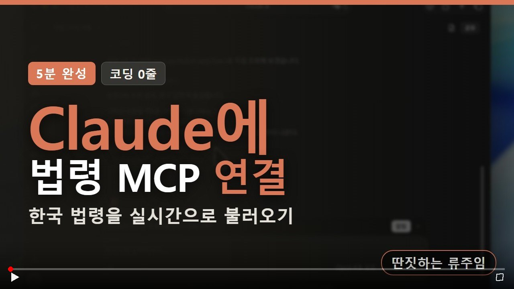
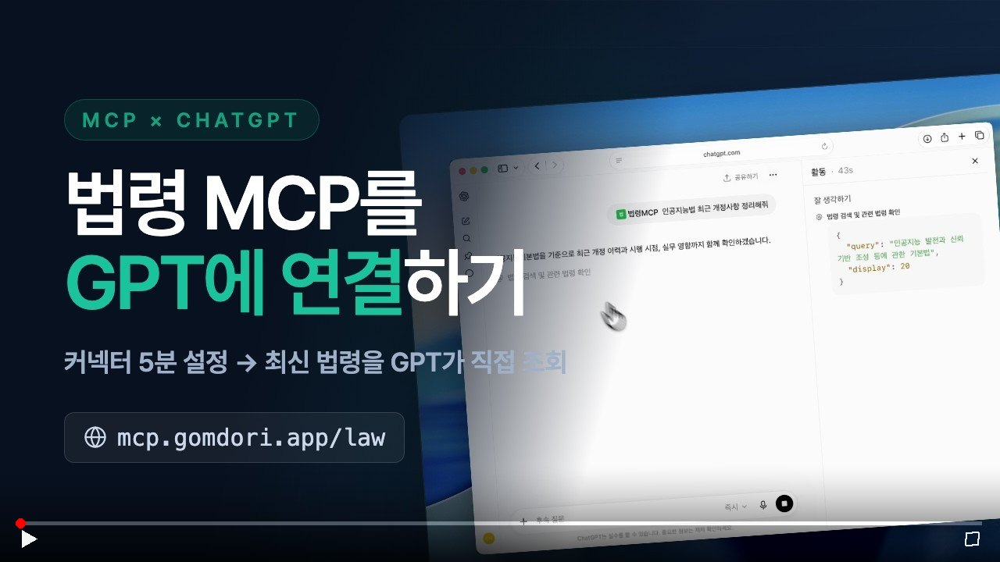
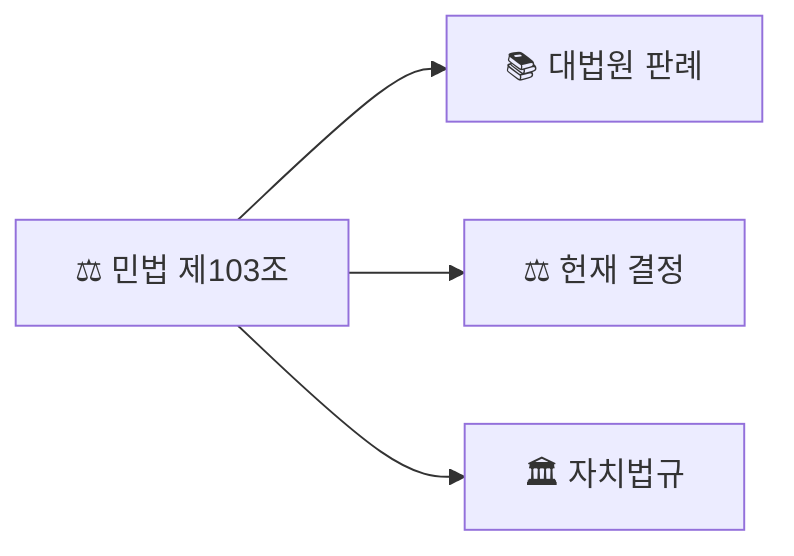

# Korean Law MCP

**법제처 42개 API를 10개 도구로.** 법령, 판례, 행정규칙, 자치법규, 조약, 해석례(국세청 포함) + **LLM 환각 방지 인용 검증(실존+내용)** + **조문 영향 그래프** + **시점 비교 자동 diff** + **이럴 땐 이렇게 — 5단계 안내** + **판례 생사 확인(Citator)** + **행위시법 판단** + **조례 정비 레이더**를 AI 어시스턴트나 터미널에서 바로 사용.

[](https://www.npmjs.com/package/korean-law-mcp)
[](https://modelcontextprotocol.io)
[](LICENSE)

<a href="https://jocohunt.com/p/5lkkxp3x" target="_blank" rel="noopener" title="조코헌트 주간 1등 Top 1 위너">
  
</a>

> 법제처 Open API 기반 MCP 서버 + CLI. Claude Desktop, Cursor, Windsurf, Zed, Claude.ai 등에서 바로 사용 가능.

[English](./README-EN.md)

[](https://youtu.be/gmkuOqIV3dc)

<sub>▶ 클릭하면 유튜브에서 재생됩니다.</sub>

### AI에 연결하기

| Claude에 연결하기 | ChatGPT에 연결하기 |
|:---:|:---:|
| [](https://youtu.be/KaUKLOH7290) | [](https://youtu.be/KCFIzervxtE) |

---

## v4.9.7 — 공용 키 사용자의 429 폭증 해소 (폴백 쿼터 토큰버킷화)

법제처 키 없이 공개 서버(`mcp.gomdori.app/law`)를 쓰는 사용자가 429를 반복해서 맞던 문제. 서버 키 폴백 쿼터는 **무키 사용자 전원이 공유하는 전역 한도**인데, 고정창(fixed window) 방식이라 창 초반 몇 명이 소진하면 나머지 사용자가 남은 창 내내 차단됐다. 실측(2026-08-12 프로덕션)에서 무키 요청 3건 중 2건이 즉시 429였다.

- **토큰버킷으로 교체** (`src/lib/rate-limit.ts`): 연속 리필이라 소진 후에도 몇 초 뒤 다시 통과한다. 평균 처리율은 그대로 두고 버스트만 흡수 — 한 대화 턴에 도구를 여러 번 부르는 MCP 사용 패턴에 맞다
- **`Retry-After` 헤더 + 대기 초 안내**: 429 본문이 `retry in Ns`를 포함하고, IP 한도 초과 응답도 JSON-RPC 형식으로 통일(기존 `{error}` 평문은 MCP 클라이언트가 파싱하지 못했다)
- **`FALLBACK_DAILY_CAP` 신설**: 분당 한도를 풀어도 하루 총량은 묶어 서버 키의 법제처 quota를 보호. 0이면 비활성(기본)
- 공개 서버 설정도 분당 `30 → 120`으로 완화하고 일일 캡 `43,200`(종전 분당 한도의 24시간 이론 총량)을 걸었다 — 총량은 유지, 버스트만 4배 완화

자체 법제처 키를 헤더(`apikey`)로 넘기는 사용자는 이 게이트를 타지 않는다(무료 발급: https://open.law.go.kr).

## v4.9.0 — 인용 검증이 **조용히 건너뛰던** 표기 3종 해소

`verify_citations`를 환각 게이트로 파이프라인에 걸어 쓸 때 가장 위험한 실패는 "검증 실패"가 아니라 **검증 미가동**이다. 법령명을 못 뽑으면 조문 실존 검증에 진입조차 못 하는데 출력은 경고(⚠)로만 보여서, 같은 텍스트에 없는 조문이 섞여 있어도 `✗`가 나오지 않는다. 사용자에겐 "통과"로 읽힌다. 표기 3종을 실사용 제보로 확인해 막았다.

```
「노인장기요양보험법」 제38조제1항 및 같은 법 시행규칙 제30조

before  ⚠ 0 실존 / 2 확인필요 — '119긴급신고의 관리 및 운영에 관한 법률 시행규칙'으로만 매칭
after   ✓ 노인장기요양보험법 제38조(재가 및 시설 급여비용의 청구 및 지급 등) 제1항 실존
        ✓ 노인장기요양보험법 시행규칙 제30조(장기요양급여비용의 청구 등) 실존
        └ 같은 텍스트의 제999조 → ✗ NOT_FOUND (존재 범위: 제1조~제44조) — 환각 게이트 가동
```

- **`「법령명」 제N조`에서 추출 실패** (#69, @BW-YU): `LAW_NAME_REGEX`가 `$` 앵커로 법령명 종단을 찾는데 표준 인용 표기의 **닫는 낫표가 lookback 끝에 남아** 앵커가 안 걸렸다(후행 공백만 제거하고 있었음)
- **가운뎃점 표기 차이** (#69, @BW-YU): 법제처 공식 제명은 한글 가운뎃점 `ㆍ`(U+318D)인데 실무 문서·판결문·LLM 출력은 라틴 중점 `·`(U+00B7)가 보통이라, 표기만 다른 같은 법이 불일치로 떨어졌다. `·ㆍ‧•・` 5종 흡수 — 무관 법령 차단(`민법`→`난민법`)은 유지
- **`같은 법 시행규칙` 조응 미해소** (#70, @gonnarun): 「A법」 제N조 및 **같은 법** 시행규칙 제M조 는 법제처 조문·관공서 서식의 표준 표기다. ① 후보 축약이 접미사 단독 후보(`시행규칙`)를 만들어 무관 법령을 물어오고 ② 선행 법령명이 승계되지 않았다. 직전 법령명을 승계하되 **선행 법령명이 없거나 빈 줄로 문단이 바뀌면 승계하지 않는다** — 무관 법령을 근거로 판정하는 게 더 나쁜 오답이다. 후보가 0개면 검색을 시도하지 않고 `⚠ 법령명 불명확`으로 떨어진다(검색 0건을 `✗ NOT_FOUND`로 낙인하면 '법령명 미상'이 '환각'으로 오보된다)

### + v4.8.0 — 외부 기여 PR 5건 (#63~#67)

행위시법 판단·연혁 파싱·검색 리졸버·재시도·폐지 법령 처리 정확도 개선.

- **분리시행 법령의 적용 버전 오특정** (#64): 조항별 시행일이 나뉘는 법령(중대재해처벌법 50인 미만 유예 등)에서 `applicable_law`가 잘못된 버전을 "기준일 시행 중"으로 특정하던 것
- **`findLaws` 기본 조회 20이 관련도 정렬을 굶김** (#66): 정확매칭이 앞 20건에 없어 무관 부분매칭 1위를 신뢰하던 문제 → 100건 + 무관 1위 차단 가드
- **폐지 법령을 '환각'으로 오탐** (#67): 폐지 법령 인용을 `⌛ REPEALED`로 분리 보고(존재≠생존)
- **연혁 페이징 조기종료·제21항+ 미지원** (#65), **DRF 간헐 404 재시도** (#63)

## v4.7.0 — 조례 정비 레이더 (`ordinance_radar`)

**"상위법 바뀌었는데, 우리 조례는 아직 그대로 아닌가?"** — 조례 담당 공무원이 매년 반복하는 상위법 개정 추적을 한 번의 호출로.

```
korean-law "광진구 주차장 조례" → ordinance_radar(ordinanceName="...")

📡 조례 정비 레이더
조례: 서울특별시 광진구 주차장 설치 및 관리 조례 (시행 20260227)
근거 상위법령 3건 대조:
  ⚠️ 주차장법 — 현행 시행 20260603 (조례보다 약 4개월 뒤 개정 → 정비 검토 대상)
  ✅ 주차장법 시행령 — 현행 시행 20250817 (조례 시행 시점까지 반영)
  ⚠️ 주차장법 시행규칙 — 현행 시행 20260331 (조례보다 약 1개월 뒤 개정 → 정비 검토 대상)
```

- **근거법 자동 추출**: 조례 제1조(목적)의 「」 인용에서 근거 법률·시행령·시행규칙을 추출 ("같은 법 시행령" 축약 표현도 해석). 본문 전체가 아닌 목적 조문만 스캔해 별표의 무관 인용(감면대상 정의의 공직선거법 등) 과잉경보를 배제
- **개정 대조**: 각 상위법의 현행 시행일 vs 조례 시행일을 대조해 정비 검토 대상을 자동 플래그, 후속 확인용 MST 동봉
- 법제처 자치법규 연계 API(lnkOrd)는 커버리지가 낮아 미사용 — 조례 본문 표준 표기 파싱으로 대체

### + v4.7.1~4.7.4 — 검색 정확도·인용 검증 패치

- **v4.7.4**: `search_law` 오법령 반환 차단 — 「인공지능 발전과 신뢰 기반 조성 등에 관한 기본법」의 통칭 "인공지능법"이 정식 제명의 부분문자열이 아니라 검색 0건 → 확장쿼리("AI법")에 법제처가 **검색어를 무시한 무관 법령 50건**을 반환하던 문제. 약칭 등록 + `hasRelatedHit` 가드(쿼리와 포함관계인 결과가 없으면 채택하지 않음)
- **v4.7.2**: `verify_citations`가 수식어 앞 법령명("절도죄는 형법 제329조…")에서 `PARTIAL_VERIFIED`로 저하돼 **환각을 놓치던** 문제 수정 (#55) + hono 보안 패치(HIGH 5건 해소, #54)
- **v4.7.1**: `legal_research`가 `scenario` 값을 `task`에 잘못 받아도 재배치해 툴콜 실패 제거 + `ordinance_radar` `query` 별칭 추가 (PlayMCP 심사 피드백)

### + v4.6.1~4.6.6 — 운영 안정화 묶음

- **v4.6.6**: 핸드셰이크(initialize/tools/list)를 rate limit에서 제외 — claude.ai 공유 egress IP가 429를 맞아 "간헐적 도구 못 찾음"이 되던 근본원인 해결 + `get_ordinance` id 별칭 수용 + `get_article_history` 날짜 미지정 시 전체기간 자동적용
- **v4.6.5/4.6.4**: MCP 등록 심사 대응 — ToolAnnotations `destructiveHint` 추가, 한글 title 제거
- **v4.6.3**: `search_law` 자치법규 자동 폴백 — 조례·지역명 쿼리 0건 시 search_ordinance 자동 시도
- **v4.6.2**: 폴백 쿼터 게이트를 tools/call만 적용 — 핸드셰이크 429 차단 해제
- **v4.7.0 보안·운영 패치 동봉**: JSON-RPC 배치의 tools/call을 개수만큼 rate limit·폴백 쿼터에 계수(배치 증폭 차단, 요청당 상한 20 — `MCP_MAX_BATCH_CALLS`) + graceful shutdown idle 연결 정리(clean exit) + `get_article_history` lawName 정확매칭 우선(가나다순 오매칭 방지)

## v4.6.0 — 인용 검증 강화(내용까지) + 클라우드 안티봇 우회

- **`verify_citations` 내용 검증**: 조문 실존 확인에 더해, `민법 제750조(계약해제)`처럼 **존재하는 조문에 엉뚱한 제목을 붙인 내용 환각**을 `[CONTENT_MISMATCH]`로 탐지. 기존엔 제750조만 실존하면 통과했으나, 이제 인용한 조문 제목이 실제와 일치하는지 대조합니다(LexDiff `citation-content-matcher` 이식 — 정규화 후 공통 substring + 문자 bigram Jaccard). `legal_analysis(mode=verify_citations)`에도 동일 적용
- **law.go.kr JS 안티봇 우회**: 클라우드 IP(GCP/AWS/Fly)에서 법제처가 API 데이터 대신 `location.assign` JS 리다이렉트 페이지를 반환할 때, 난독화 URL을 파싱해 토큰 URL로 자동 우회(최대 3홉, 토큰 URL 404 시 원본 재시도). 로컬/등록 IP에선 no-op — `Referer` 주입(v4.0.9)으로도 안 뚫리는 클라우드 환경의 방어층

## v4.5.0 — 시행예정 법령 감지 (제명변경 오판 방지)

`search_law`가 시행예정(`target=eflaw`) 보조검색을 수행해 결과에 병기합니다.

- **제명변경 예정**: 「데이터기반행정 활성화에 관한 법률」→「인공지능 및 데이터 기반 행정 활성화에 관한 법률」(2026-08-28 시행)처럼 공포~시행 사이의 제명변경을 신·구 명칭 매핑으로 표시 — 신명칭 검색 시 "정확매칭 없음"만 떠서 LLM이 "법령 없음"으로 오판하던 문제 해결
- **개정 시행예정**: 검색된 현행 법령에 시행 대기 중인 개정이 있으면 시행일·공포번호와 시행예정본 MST 안내
- **미시행 신규 법령**: 공포됐지만 아직 시행 전이라 현행 검색 0건인 법령을 별도 안내 (효력 없음 경고 포함)

## v4.4.1–4.4.3 — 안정성 패치

- **v4.4.3**: `zod`를 `^4`로 고정 — 신규 설치가 zod 3.x를 해석해 `listTools` 첫 호출에서 `z.toJSONSchema is not a function`으로 크래시하던 문제 해결
- **v4.4.2**: `get_annexes` 행정규칙 별표/서식 조회 복구 — 응답 키 `admrulbyl` 우선 파싱 + "...시행세칙" 자동 판별 + 동일 bylSeq 별표/서식 충돌 분리 (#50/#49/#51)
- **v4.4.1**: 광고 스키마 `required` 버그 수정 — `.default()` 필드(`legal_research.task`·`search_law.display`)가 필수 입력으로 노출되던 문제(`io:"input"` 명시) + `legal_analysis` 비용 옵션 패스스루 + 비호환 scenario 경고 노트

## v4.4.0 — 노출 도구 통폐합 19개 → 9개 (컨텍스트 52% 감축)

MCP 클라이언트가 매 세션 읽는 도구 목록(ListTools)을 ~15.1KB → ~7.2KB로 줄였습니다.

- `chain_*` 8개 → **`legal_research`** 하나로 (`task` 파라미터: full_research·law_system·action_basis·dispute_prep·amendment_track·ordinance_compare·procedure_detail·document_review)
- 킬러피처 4개(`verify_citations`·`cite_check`·`applicable_law`·`impact_map`) → **`legal_analysis`** 하나로 (`mode` 파라미터)
- **하위호환**: 기존 도구명 직접 호출·`execute_tool` 경유 모두 그대로 동작. 광고 목록에서만 빠짐

## v4.3 — 판례 생사 확인 + 행위시법 판단

**"이 판례 아직 유효한가?" + "사건 시점엔 어떤 법이 적용되나?"** — 법률 실무에서 가장 위험한 두 실수를 잡는다.

### 1. `cite_check` — 판례 생사 확인 (한국형 Shepard's Citator)

```
"2007다27670 아직 유효해?"
```

→ 그 사건번호를 **인용한 후속 판례를 본문검색으로 역추적** + 전원합의체 후속 판결 본문 정밀 스캔 → 변경·폐기 선언 감지:

```
📊 판정: ❌ 변경·폐기 신호 감지 — 2018다248626(판례 변경 선언, 저촉 범위 변경)
   맥락: "…2008년 전원합의체 판결은 이 판결의 견해와 배치되는 범위에서 변경하기로 한다…"
```

판결문이 사건번호 대신 "(이하 '2008년 전원합의체 판결'이라 한다)" 별칭으로 변경 선언하는 관행까지 추적. 변경된 판례를 살아있는 것처럼 인용하는 사고를 차단한다. 무료 도구 중 유일.

### 2. `applicable_law` — 행위시법 판단 + 부칙 경과규정

```
"2023.5.10 당시 도로교통법 제44조"
```

→ 기준일에 **시행 중이던 버전(MST) 특정** → 그 시점 조문 본문 → 현행과 비교 → **이후 개정 부칙의 적용례·경과조치 자동 발췌** + 행위시법(형법 §1)·제재처분 위반행위시법(행정기본법 §14③) 법리 안내. LLM이 현행법으로 오답하는 것을 구조적으로 방지.

---

## v4.0 — 3개 킬러 기능 동시 추가

**조문 영향 그래프 + 시점 비교 + 단계별 안내.** 법무팀·연구자·실수요자가 매뉴얼로 며칠 걸리던 작업이 한 번에.

### 1. `impact_map` — 조문 한 줄의 파급효과 그래프

```
"민법 제103조 인용한 판례"
```

→ 대법원 판례·헌재 결정·법령해석·행정심판·자치법규를 **역방향 탐색** + 조문이 인용한 다른 법령(정방향) + **mermaid 그래프 코드** 자동 생성. claude.ai에서 바로 시각화.



### 2. `time_travel` — 두 시점 본문 자동 diff

```
"개인정보보호법 2020-01-01 vs 2025-11-01"
```

→ 임의의 두 시점에 시행 중이었던 본문을 자동으로 가져와 **조문 단위 자동 diff**: 추가(+) / 삭제(-) / 변경(△) 분류 + 변경 전후 본문 + 자수 변화량.

### 3. `action_plan` — 이럴 땐 이렇게, 5단계 안내

```
"전세금 못 받았어"
```

→ STEP 1 상황진단(주택임대차보호법 자동 식별) → STEP 2 권리/구제수단(판례) → STEP 3 신청기관/기한(행정규칙+해석) → STEP 4 필요서류/양식(별표) → STEP 5 함정/주의(시효·법률구조공단). 평소 말투 그대로 → 실행 가능한 단계로 변환.

### + v4.2.0 — 법령 현행성 가드 (개정 전 법령 오답 방지)

`search_law` 결과에 `[현행]` / `⚠️[연혁-과거버전]` 라벨 + 시행일 표기(현행 우선 정렬), `get_law_text` 본문 헤더에 조회기준일 vs 시행일 비교 라벨(시행 예정·efYd 과거 조회 경고)과 **구 법령명**("(구 법령명: 화재예방, 소방시설 설치ㆍ유지 및 안전관리에 관한 법률…)") 표기. LLM이 분법·개정된 법령을 학습데이터 속 옛 버전과 혼동하지 않도록 도구 출력 단계에서 차단.

### + v4.1.0 — 판례 검색 구조화 + 상세 증거 자동 연결

판례 검색을 공통 구조화 core(`searchPrecedentsStructured`)로 통합. 긴 자연어/개념형 질의를 compact query로 보정하고, 사건번호→제목→본문검색 순으로 폴백. 상위 판례를 `get_precedent_text`에 자동 연결(기본 2건/최대 5건)해 근거 본문을 함께 제공하며, `search_decisions(domain="precedent", options.includeText=true)`로 opt-in. 다건 상세조회 합산 시 뒷 판례가 잘리던 문제도 건당 본문 예산 배분으로 해결. (외부 PR #46 + 후속 최적화)

### + v4.0.9 — 법제처 API `Referer` 헤더 자동 주입

법제처 OPEN API가 **`Referer` 헤더 없는 요청을 OC 키 유효 여부와 무관하게 거부**("사용자 정보 검증 실패")하는 문제 대응. `law.go.kr` 계열 호스트 호출 시 기본 `Referer`를 자동 주입한다(`LAW_REFERER`로 override). IP/도메인 등록 문제로 오인되기 쉬운 증상의 실제 근본 원인이었음 — IP 등록을 했는데도 모든 검색이 실패하던 케이스를 해결. (외부 PR #45)

### + v4.0.8 — 법제처 빈/HTML 응답 자동 재시도

법제처 OPEN API가 간헐적으로 200 상태에 **빈 본문이나 HTML 점검 페이지**를 반환하던 문제 대응. 이 경우 XML 파서가 `missing root element`로 터지며 "됐다 안 됐다" 증상이 발생했음. `fetchWithRetry`가 빈/HTML 응답을 일시 장애로 간주해 자동 재시도(exponential backoff)하고, 재시도 소진 후에도 빈 응답이면 `search_law`가 `missing root element` 대신 명확한 안내 메시지를 반환하도록 수정. (IP 등록·OC 키와 무관한 외부 응답 불안정 이슈)

### + v4.0.7 — 국세청 판례 본문 fallback

법제처 JSON API에 본문이 비어 오는 판례를 국세청 `taxlaw.nts.go.kr`에서 HTML로 자동 보강. JSON 실패·파싱 실패·본문 누락 세 경우 모두 fallback으로 진입하며 안전하게 회수됨. 사내망/SSL inspection 환경용 `LAW_EXTERNAL_HTTPS_PROXY`(선택)·`LAW_EXTERNAL_TLS_REJECT_UNAUTHORIZED`(진단용) 지원 — 자세한 설정은 아래 "국세청 판례 서버 TLS/프록시 설정" 섹션 참조. (외부 PR #44)

### + v4.0.6 — 법제처 API 프로토콜 설정 + 판례 재검색 개선

폐쇄망/인증서 문제 환경을 위해 `LAW_API_PROTOCOL=http` 옵션 추가(기본 https). 판례 재검색 키워드 후보 생성 개선으로 매칭률 향상. (외부 PR #41/#42)

### + v4.0.5 — 의존성 취약점 일괄 패치 (Security)

`npm audit` High 4건(@xmldom/xmldom 5건의 XML injection + DoS, @hono/node-server 경로 우회, express-rate-limit IPv6 우회, fast-uri path traversal) 일괄 패치. 모두 semver-major 변경 없는 patch/minor 업데이트. `npm audit` → **0 vulnerabilities**. 코드 변경 0건. 자세한 GHSA 목록은 [CHANGELOG](CHANGELOG.md#405---2026-05-23) 참조.

### + v4.0.4 — 약어 부분 매칭

기존 약어 처리는 query 전체가 등록 약어와 정확 일치할 때만 동작 ("화관법" → "화학물질관리법"). v4.0.4는 약어가 다른 토큰과 **결합된** query도 풀네임 변형으로 자동 확장.

```
"화관법 시행령"      → "화학물질관리법 시행령"
"화관법 제5조"       → "화학물질관리법 제5조"
"산안법 시행규칙"    → "산업안전보건법 시행규칙"
"중처법 제4조 책임자" → "중대재해 처벌 등에 관한 법률 제4조 책임자"
```

`extractEmbeddedAliases` 신규 + `expandLawQuery`/`expandOrdinanceQuery` 통합. 회귀 0건.

---

## v3.5 — AI 법률 답변의 환각을 잡아내다

**LLM이 지어낸 가짜 조문을 실시간으로 탐지.** 법제처 공식 DB로 모든 인용을 교차검증.

```
"민법 제750조에 따라 불법행위 손해배상을 청구하고,
 근로기준법 제60조 제1항은 연차유급휴가를 규정하며,
 상법 제401조의2 제7항에 따라 이사 책임을 물을 수 있고,
 형법 제9999조는 가중처벌을 정한다"
```

→ `verify_citations` 한 번으로 (실제 법제처 API 교차검증 결과):

- ✓ 민법 제750조(불법행위의 내용) 실존
- ✓ 근로기준법 제60조(연차 유급휴가) 제1항 실존
- ✗ **상법 제401조의2 — 제7항 없음 (최대 제2항)**
- ✗ **형법 제9999조 — 해당 조문 없음 (존재 범위: 제1조~제372조)**

**ChatGPT·Claude가 쓴 법률 답변을 그대로 믿지 마세요.** 법률 AI 서비스, 로펌, 학생, 계약서 검토에서 신뢰도 체크 필수.

---

## v3.2.0+ — 자연어로 복합 분석

사용법은 똑같습니다. **그냥 자연어로 물어보세요.** AI가 질문을 알아듣고, 필요한 분석을 자동으로 추가해줍니다.

### 과태료 받았는데, 감경 가능할까?

```
"식품위생법 영업정지 과태료 감경 가능?"
```

→ 위반 유형별 **처분 기준표** (1차·2차·3차 금액) + **벌칙 조항** 원문 + 실제로 **감경된 행정심판 사례** + 해당 조항 **개정 이력**까지 한 번에 나옵니다.

### 이 물건 수입하려는데, 법적으로 뭘 확인해야 하지?

```
"수입 통관 FTA 적용 확인"
```

→ **관세법** + **관세청 유권해석** + **FTA 조약 원문** + **세율 별표** + 관세 분쟁 시 **조세심판원 판결**까지. 예전에는 법제처·관세청·조세심판원·외교부 4곳을 따로 뒤져야 했습니다.

### 건축허가 처리, 어디서부터 시작하지?

```
"건축법 허가 절차"
```

→ **법적 근거** (법률→시행령→시행규칙) + **수수료·서식** + 관련 **훈령·예규·고시** + 우리 지자체 **조례 특칙** + **유권해석**까지 원스톱.

### 법 하나 고치면 뭐가 같이 바뀌어야 하지?

```
"건축법 영향도 분석"
```

→ **하위법령**(시행령·시행규칙) + 전국 **자치법규** 중 영향받는 것 + 관련 **행정규칙** 목록이 나옵니다.

### 이 법의 위임 사항, 다 만들어졌나?

```
"국민건강보험법 위임입법"
```

→ "시행령으로 정한다"고 돼 있는 조항 중 **아직 시행령이 안 만들어진 것**을 찾아줍니다.

### 이 조례, 상위법에 어긋나지 않나?

```
"주차 조례 상위법 적합성"
```

→ **헌법재판소 위헌 결정** + **행정심판 취소 사례** 중 비슷한 조례 관련 건을 검색하고, **상위법 근거**를 대조합니다.

### 이 조문, 언제 바뀌었고 판례는 어떻게 달라졌지?

```
"근로기준법 개정이력 타임라인"
```

→ **신구대조표** + 조문별 **개정 이력** + 해당 법령의 **판례·해석례**를 시간순으로 묶어줍니다.

---

> **사용법 변경 없음.** 기존처럼 자연어로 물어보면 됩니다. 질문에 따라 AI가 알아서 추가 분석을 붙입니다.
>
> 모든 결과 끝에 **"이어서 할 수 있는 조회"**가 제안됩니다. 복사해서 바로 이어가세요.

<details>
<summary>v3.2.1~v3.5.5 변경 이력</summary>

**v3.5.5** — 법제처 API 봇 차단 우회 (긴급 핫픽스)

법제처 OPEN API가 Node.js 기본 User-Agent(`undici/...`)를 봇으로 분류해 거부하기 시작 → fly.dev/Vercel 등 모든 클라우드 호스팅에서 `[EXTERNAL_API_ERROR] fetch failed` 또는 "사용자 정보 검증에 실패하였습니다" XML로 죽는 현상.

- **`fetch-with-retry.ts`에 일반 브라우저 UA 기본 헤더 주입** — 호출자 코드 변경 0, 한 줄 패치로 모든 도구 복구. `LAW_USER_AGENT` 환경변수로 override 가능
- 에러 메시지가 "정확한 서버장비의 IP주소 및 도메인주소를 등록해 주세요"여서 IP 화이트리스트 차단으로 오인되기 쉬웠음 — 실제 원인은 UA 검증
- claude.ai 커스텀 커넥터로 `https://korean-law-mcp.fly.dev/mcp?oc=...` 사용하던 사용자 즉시 영향. v3.5.5 배포로 자동 복구

**v3.5.4** — 실사용 피드백 반영: NOT_FOUND 명시 시그널 전면 도입

사용자 피드백: "실사용하면 자꾸 답변 못 찾고 AI가 지맘대로 답변함. 못 찾으면 리턴값을 명확하게."

**근본 원인**: 일부 도구가 조회 실패 시 `isError` 플래그를 세팅하지 않거나 "없습니다"만 반환 → LLM이 실패 감지 못하고 창작 답변 생성.

- **`[NOT_FOUND]` / `[HALLUCINATION_DETECTED]` 머신 파싱 마커 전면 도입** — 모든 실패 응답에 기계적으로 감지 가능한 프리픽스 + "⚠️ LLM은 추측/생성 금지" 경고문 표준화
- **`verify_citations`** — `failCount > 0`일 때 `isError: true` 설정. 환각 검출됐는데 "검증 성공"으로 오인되던 심각한 버그 수정
- **`annex.ts` / `law-text.ts` / `article-detail.ts` 등 10+개 파일** — `isError: true` 누락 수정
- **체인 도구 부분 실패 투명화** — `chains.ts`의 silent-drop 패턴 제거. 실패한 섹션도 `[NOT_FOUND / FAILED]` 마커와 사유를 명시 노출 (80자 → 200자 확장)
- 신규 헬퍼 `notFoundResponse(message, suggestions?)`로 일관성 확보

**v3.5.3** — `verify_citations` 실증 검증 후 3개 치명 버그 수정

실제 법제처 API로 5건 테스트 → false negative 3건 발견 → 근본 원인 수정:

- **"민법" → "난민법" 부분매칭 오매칭** — 기존 `chains.ts`의 `findLaws`/`scoreLawRelevance`가 이미 해결해둔 로직인데 verify_citations가 재사용하지 않고 자체 로직으로 중복 구현했던 것. 공용 모듈 `lib/law-search.ts`로 추출하여 양쪽 재사용 (중복 제거)
- **원숫자(①②③…) 항번호 파싱 실패** — 법제처 API가 `항번호`를 `"① "` 형태로 리턴하는데 기존 `parseInt(raw.replace(/[^\d]/g, ""))`가 유니코드 원숫자를 제거해 NaN. 근로기준법 제60조 제1항이 실존함에도 "최대 제0항" 오판정 → `lib/article-parser.ts`에 `parseHangNumber()` 원숫자 매핑 유틸 추가
- **짧은 법령명 검색 누락** — 법제처 lawSearch API가 `display=20`에서 "상법"을 결과 34번째로 리턴. `apiClient.searchLaw`에 display 파라미터 추가, verify_citations는 `searchDisplay=100`으로 호출

검증 후 5/5 정확 판정 (위 예시 결과가 그 출력).

**v3.5.2** — kordoc 2.3.0 → 2.4.0 업데이트 (별표/서식 파싱 엔진)

**v3.5.1** — lite/full 프로필 체계 제거 (V3_EXPOSED 16개 고정 노출 도입 후 실질 미사용). `tool-profiles.ts`에서 `LITE_TOOLS`/`parseProfile`/`filterToolsByProfile` 제거, 헬스 엔드포인트 거짓 `profiles` 필드 → 정확한 `tools: { exposed: 16, total: 92 }` 로 교체. Breaking change 아님 (`?profile=lite`도 이미 무시되던 값)

**v3.5.0** — Killer feature: `verify_citations` 인용 검증 + Critical 핫픽스 + 보안 강화

- **`verify_citations`** 신규 — LLM 환각 방지. 사용자 텍스트에서 조문 인용 정규식 추출 + 직전 30자 lookback으로 법령명 역추적 + 법제처 DB 병렬 교차검증. 결과: ✓(실존) / ✗(없음, 존재 범위 제시) / ⚠(법령명 불명확)
- **Critical 핫픽스** — v3.4.0 `full` 파라미터가 12개 도메인(tax_tribunal, customs, ftc, pipc, nlrc, acr, treaty, interpretation 등)에서 스키마에 필드가 없어 조용히 무시되던 문제 수정. `unified-decisions.ts`가 하위 핸들러 응답을 받은 뒤 `compactLongSections()` 후처리로 계단식 축약 일괄 적용
- **보안 High 2건** — `fetch-with-retry.ts` 타임아웃/네트워크 에러에 API 키 포함 URL이 로그로 유출되던 문제 → `maskSensitiveUrl()`로 `OC=***` 마스킹. `trust proxy true` → `TRUST_PROXY` 환경변수(기본 `1`), X-Forwarded-For 스푸핑 rate limit 우회 차단
- **품질 3건** — `decision-compact.ts` 날짜 정규식 경계 가드, TAIL 경계 `". "` 오탐 제거, `stripRepeatedSummary` 종료점 정확 탐지
- **UX** — 체인 8개 description 구체화(LLM이 체인 선택 가능), 검색 결과 "💡 다음: get_law_text(...)" 힌트, `search_law` 약칭/오타 확장 자동 재시도, `query-router` 패턴 5개 추가, `discover_tools` 별칭 매칭 27개

**v3.4.0** — 판례 응답 토큰 평균 74% 감축 + `get_decision_text`에 `full` 파라미터 추가

법령 RAG 관점에서 판례 응답 구조를 재해석: 판시사항·판결요지·주문은 규범 재사용의 핵심이라 full 유지, "이유" 전문은 사안별 사실관계 나열이라 LLM이 대부분 소비만 하고 버림. 이 비대칭을 활용해 판례/헌재/행심(`precedent`/`constitutional`/`admin_appeal`) 3개 도메인에 **계단식 축약 + structured ref densify** 적용. `lib/decision-compact.ts` 신규:

- **`compactBody`** — 전문/이유 섹션을 앞 800자 + 중략 마커 + 뒤 400자로 축약. 판결 종결어미(`~다.`, `~라 할 것이다.`)와 문장 경계 가드 내장. `minSave` 가드로 짧은 본문(1300자 이하)은 skip
- **`densifyLawRefs`** — 참조조문의 괄호 설명 제거 (`제390조(채무불이행과 손해배상)` → `제390조`). 평균 40~55% 절감
- **`densifyPrecedentRefs`** — 참조판례의 "선고"/"판결" 제거 + 날짜 공백 압축 (`2020. 3. 26. 선고 2018두56077 판결` → `2020.3.26. 2018두56077`)
- **`stripRepeatedSummary`** — 법제처 API가 판시/요지를 본문 앞쪽에 또 섞어 보내는 케이스 탐지·제거

`get_decision_text`에 `full?: boolean` 파라미터 추가. 미지정(기본)=축약, `true`=전문. 응답 중간의 `⋯ 중략 N자 (full=true로 전문 조회) ⋯` 마커가 재호출 힌트 역할.

**실측 (실제 법제처 API, 고정 ID 8건)**:

| 도메인 | Before avg | After avg | 절감 |
|---|---:|---:|---:|
| 판례 | 5,230 chars | 3,049 chars | **-42%** |
| 헌재 | 8,368 chars | 1,703 chars | **-80%** |
| 행심 | 8,429 chars | 1,491 chars | **-82%** |
| **종합** | **7,606 chars (1,901 tok)** | **1,960 chars (490 tok)** | **-74%** |

긴 결정례(15,000자↑)에서 **80~89%** 절감이 가장 두드러짐. 짧은 본문은 `minSave` 가드로 원본 유지. 품질 손실 없음 (판시·요지·주문은 항상 full).

부가로 **ListTools 페이로드도 -14%** (9,671 → 8,296 bytes, 344 토큰↓): `chain_*` 8개 description 간결화, `search_decisions`/`get_decision_text` 필드 describe에서 17 도메인 중복 표기 제거.

**v3.3.1** — 법령 약칭 사전 대폭 확장 (11 → 52개, +41)

lexdiff에서 "산안기준규칙" 질의가 법제처 aiSearch의 키워드 부분매칭으로 **국가표준기본법**으로 환각되던 사례가 발견돼 `resolveLawAlias`의 `LAW_ALIAS_ENTRIES`를 대폭 보강. 다빈도 노무/안전(산안법·중처법·근기법 등), 개인정보/정보통신(개보법·정보통신망법), 청렴/이해충돌(청탁금지법·이해충돌방지법), 공공계약(국가계약법·지방계약법), 부동산/임대차(주임법·상임법·부거법), 공정거래(공정거래법·하도급법·약관법·표시광고법·가맹사업법), 금융(자본시장법·특금법·전금법), 도시계획(국토계획법·도정법), 환경(감염병예방법·대기환경법), 운수(여객운수법·화물운수법), 민·형사 절차(민소법·형소법·민집법), 사회보험(국건법·산재보험법·고보법), 통신(전기통신사업법) 커버. `api-client.ts`/`law-parser.ts`가 이미 `resolveLawAlias`를 사용 중이라 **데이터 추가만으로 기존 검색 경로가 자동 혜택**. 신규 41개 + 회귀 4개 포함 **45/45 테스트 통과**.

**v3.3.0** — HTTP stateless 모드 전환 + kordoc 2.3.0

원격 서버(`korean-law-mcp.fly.dev`)가 주기적으로 OOM kill로 재시작되면서 기존 세션 ID가 무효화되던 문제를 근본 해결. MCP 공식 stateless 패턴(`sessionIdGenerator: undefined`)으로 전환하여 매 요청마다 fresh `Server + Transport`를 생성, 요청 종료 시 즉시 해제. in-memory 세션 Map·InMemoryEventStore·idle cleanup 전부 제거로 누수 원인 소거. 재시작·스케일아웃·배포 모두 무손실. `GET /mcp`·`DELETE /mcp`는 공식 예제와 동일하게 `405`. API 키는 `AsyncLocalStorage`로 요청 단위 격리 (race condition 방지).

- **HTTP stateless 전환** — [src/server/http-server.ts](src/server/http-server.ts) (참고: `@modelcontextprotocol/sdk/examples/server/simpleStatelessStreamableHttp.js`)
- **kordoc 2.2.5 → 2.3.0** — 별표/서식 파싱 엔진 업데이트
- **세션 관리 코드 완전 제거** — `sessions` Map, `MAX_SESSIONS`, idle cleanup `setInterval`, `InMemoryEventStore`, POST/GET/DELETE 분기 로직 삭제 (v3.2.3의 LRU eviction 접근을 대체)

**v3.2.3** — HTTP 세션 안정성 중간 개선. `MAX_SESSIONS` 100→500 + LRU eviction. _v3.3.0의 stateless 전환으로 대체됨._

**v3.2.2** — 별표/서식 조회 도구(`get_annexes`)를 기본 노출 도구에 추가. **노출 도구 수 14 → 15개**. 환불·감경 키워드 질의 시 별표 자동 조회 로직 추가.

**v3.2.1** — kordoc 2.2.5 업데이트.

</details>

<details>
<summary>개발자용: 시나리오 기술 상세</summary>

기존 8개 체인 도구에 `scenario` 파라미터가 추가됐습니다. (노출 도구 수는 v3.5의 `verify_citations`, v4.0의 `impact_map`까지 추가돼 17개)

| scenario | 호스트 체인 | 추가 조회 |
|---------|-----------|----------|
| `penalty` | chain_action_basis | 별표 처분기준표 + 벌칙 조항 + 감경 행심 + 개정이력 |
| `customs` | chain_full_research | 관세청 해석례 + 조세심판 + FTA 조약 + 세율표 + 3단비교 |
| `manual` | chain_procedure_detail | 법체계(행정규칙) + 해석례 + 연계 자치법규 |
| `delegation` | chain_law_system | 위임법령 현황 + 법체계(행정규칙) + 조문 이력 |
| `impact` | chain_law_system | 법체계 트리 + 연계 조례 + 조문별 연계 + 행정규칙 |
| `timeline` | chain_amendment_track | 판례 + 해석례 시계열 매핑 |
| `compliance` | chain_ordinance_compare | 헌재 위헌 결정 + 행심 위법 취소 + 상위법 근거 |

시나리오는 쿼리 키워드에서 **자동 감지**되거나, `scenario` 파라미터로 **직접 지정**할 수 있습니다.

**기타 개선:**
- 법령체계도(`get_law_system_tree`)에 행정규칙(훈령/예규/고시) 출력 추가
- 법령 검색 3차 fallback — 복합 쿼리에서 법령명 패턴 자동 추출
- `chain_action_basis` 판례/해석례 검색 정확도 향상 (법령명 기반 검색)

</details>

<details>
<summary>v3.1.0~v3.1.5 변경 이력</summary>

**v3.1.5** — kordoc 2.2.4 + 문서 파싱 엔진 강화. README 현행화.

**v3.1.4** — kordoc 2.2.4 업데이트. 병합 셀 HTML `<table>` 출력, markdownToHwpx 서식 강화.

**v3.1.3** — 검색 결과 없음 힌트 통합 (18개 도구). 세션 정리 주기 단축 (30분→10분).

**v3.1.2** — kordoc 2.2.1 업데이트. GFM 테이블 특수문자 이스케이프 및 pipe 충돌 방지.

**v3.1.1** — kordoc 2.1→2.2 업데이트.

## v3.1.0 — Production Hardening

실사용 점검 기반 20개 파일 수정. 잠재적 버그, 보안, 안정성 일괄 개선.

- **truncateResponse 누락 일괄 수정** — 17개 도구에서 50KB 응답 제한 미적용 수정
- **HTTP 서버 세션 제한** — MAX_SESSIONS=100 추가, 503 응답 (DoS 방어)
- **CORS 와일드카드 경고** — 미설정 시 stderr 경고 로그 추가
- **파라미터 오염 방어** — `search_decisions`/`get_decision_text`의 options에서 핵심 필드 덮어쓰기 차단
- **체인 도구 안정성** — 인증 에러(401/403/429) 즉시 전파, findLaws 안전 래핑
- **API 클라이언트** — throwIfError에서 response body 소비 (스트림 누수 방지)
- **CLI 개선** — REPL 모드 Ctrl+C 2회 강제종료 구현
- **SSE 서버 제거** — 사용되지 않는 데드코드 삭제 (HTTP 서버가 SSE 스트리밍 지원)
- **데드 코드/의존성 정리** — `zod-to-json-schema`, ordinance 힌트, `start:sse` script

</details>

<details>
<summary>v3.0.x 변경 이력</summary>

**v3.0.2** — Unified Architecture + Setup Wizard

법제처 41개 API를 89개 MCP 도구로 구조화했던 v2.
v3는 같은 41개 API를 **14개 도구**로 재압축했습니다 (v3.2.2 이후 15개, v4.3에서 19개, v4.4.0에서 통폐합으로 9개).

| | 법제처 원본 | v2 | v3 |
|---|:---:|:---:|:---:|
| API/도구 수 | 41 | 89 | **14** |
| AI 컨텍스트 비용 | - | ~110 KB | **~20 KB** |
| 기능 커버리지 | - | 100% | **100%** |
| 프로필 관리 | - | lite/full 분리 | **단일 (불필요)** |

### 왜 89개가 14개가 됐나

v2의 실수: API 하나당 도구 하나. 직관적이지만, AI 입장에서는 89개 스키마를
전부 읽어야 해서 **컨텍스트의 절반을 도구 목록에 소비**했습니다.

v3의 접근 전환: 비슷한 패턴의 도구를 `domain` 파라미터 하나로 통합.
판례·헌재·조세심판·공정위 등 **18개 도메인**이
`search_decisions(domain)` + `get_decision_text(domain)` **2개**로 합쳐졌습니다.

나머지 전문 도구(용어, 별표, 이력 등)는 그대로 작동하되,
`discover_tools` → `execute_tool`로 필요할 때만 접근합니다.

### 사용자 입장에서 뭐가 좋아지나

- **AI가 더 정확함** — 89개 중 고르던 AI가, 14개만 보고 즉시 판단
- **응답 속도 체감 향상** — 컨텍스트 82% 절감
- **설정 단순화** — lite/full 프로필 선택 불필요. 모든 클라이언트에서 동일한 14개
- **17개 결정례 도메인 즉시 접근** — discover 거치지 않고 바로 검색

### 기타 변경

- **kordoc 1.6 → 2.2.5** — 문서 파싱 엔진 업그레이드 (XLSX/DOCX 지원, 보안 강화, 양식 채우기)
- **행정심판 전문 조회 버그 수정** — API 응답 키 fallback 추가
- **영문법령 전문 조회 버그 수정** — 신형 API 응답 구조 지원

### 개발자에게

MCP 도구 설계에서 **도구 수 ≠ 기능 수**입니다.
41개 API를 89개로 펼쳤다가 다시 14개로 접은 이 과정이
"적정 추상화 수준"을 찾는 여정이었습니다.

핵심 패턴: **Dispatch Table + Domain Enum**.
기존 handler 함수는 한 줄도 수정하지 않았습니다.

</details>

<details>
<summary>v2.x 변경 이력</summary>

**v2.3.2** — 운영 코드 품질 개선 (47파일, -179줄). 이모지/장식 축소, 체인 캐시, 에러 처리 통일.

**v2.3.0** — 도구 프로필 (lite/full), URL 쿼리 API 키, kordoc 통합 파서.

**v2.2.0** — 23개 신규 도구 (64→87). 조약, 법령-자치법규 연계, 문서분석 엔진.

**v1.8~1.9** — 체인 도구 8개, 일괄 조문 조회, AI 검색 필터, 구조화 에러 포맷.

</details>

---

## 왜 만들었나

대한민국에는 **1,600개 이상의 현행 법률**, **10,000개 이상의 행정규칙**, 그리고 대법원·헌법재판소·조세심판원·관세청까지 이어지는 방대한 판례 체계가 있습니다. 이 모든 게 [법제처](https://www.law.go.kr)라는 하나의 사이트에 있지만, 개발자 경험은 최악입니다.

이 프로젝트는 그 전체 법령 시스템을 **10개 도구**로 감싸서, AI 어시스턴트나 스크립트에서 바로 호출할 수 있게 만듭니다. 법제처를 수백 번 수동 검색하다 지친 공무원이 만들었습니다.

---

## 설치 및 사용법

### 0단계: API 키 발급 (무료, 1분)

모든 방법에 공통으로 필요한 **법제처 Open API 인증키(OC)**를 먼저 발급받으세요.

1. [법제처 Open API 신청 페이지](https://open.law.go.kr/LSO/openApi/guideList.do)에 접속합니다.
2. 회원가입 후 로그인합니다.
3. **"Open API 사용 신청"** 버튼을 누릅니다.
4. 신청서를 작성하면 **인증키(OC)**가 발급됩니다. (예: `honggildong`)
5. 이 인증키를 아래 설정에서 사용합니다.

---

### 방법 1: Claude Code 플러그인 (한 줄 설치, 가장 쉬움) ⚡

[Claude Code](https://claude.com/claude-code)를 쓴다면 두 줄이면 끝. API 키는 설치 중 자동으로 물어봅니다.

```
/plugin marketplace add chrisryugj/korean-law-mcp
/plugin install korean-law@korean-law-marketplace
```

설치 중 **법제처 API 키**를 입력하라는 프롬프트가 뜹니다 (0단계에서 발급받은 `honggildong` 같은 키). 민감정보로 안전하게 저장됩니다.

**사용:** Claude Code에 자연어로 질문하면 `korean-law` MCP 도구가 자동 호출됩니다.

```
"근로기준법 제74조 알려줘"
"민법 제750조 판례 검증해줘"
```

**업데이트:** 새 버전이 나오면 한 줄로 최신화
```
/plugin marketplace update korean-law-marketplace
```

> 내부적으로 `npx korean-law-mcp@latest`를 실행하므로 npm에 배포된 최신 버전이 항상 사용됩니다.

#### Troubleshooting: `Permission denied (publickey)` 에러

설치 중 다음 에러가 뜨면 Claude Code 설치기가 GitHub에 SSH로 접속을 시도했는데 SSH 키가 등록돼 있지 않은 경우입니다 (특히 처음 Git을 쓰는 비개발자/법률 실무자에게 자주 발생).

```
Failed to install: Failed to clone repository: Cloning into
  '/Users/<user>/.claude/plugins/cache/temp_github_<id>'...
  git@github.com: Permission denied (publickey).
  fatal: Could not read from remote repository.
```

**해결 방법 (둘 중 하나 선택):**

1. **HTTPS로 강제 우회 (가장 간단, 추천):** 터미널에 한 줄 실행 후 다시 `/plugin install` 시도
   ```bash
   git config --global url."https://github.com/".insteadOf "git@github.com:"
   ```

2. **SSH 키 생성 후 GitHub에 등록:** GitHub 계정으로 다른 저장소를 SSH로 자주 쓸 예정이라면
   ```bash
   ssh-keygen -t ed25519 -C "your-email@example.com"   # 엔터 3번
   cat ~/.ssh/id_ed25519.pub                            # 출력 복사
   ```
   복사한 공개키를 [GitHub → Settings → SSH and GPG keys → New SSH key](https://github.com/settings/keys)에 붙여넣기

설치 후에도 위 rewrite 설정은 그대로 둬도 무방합니다 (HTTPS clone이 항상 동작).

---

### 방법 2: Claude.ai 웹에서 바로 사용 (설치 없음)

아무것도 설치하지 않고, 주소 하나만 입력하면 됩니다. Claude Pro/Max/Team/Enterprise 요금제가 필요합니다 (Free는 커넥터 1개만 가능).

**커넥터 추가 방법:**

1. [claude.ai](https://claude.ai)에 로그인합니다.
2. 왼쪽 사이드바 하단의 **본인 이름**을 클릭합니다.
3. **"설정"** (또는 Settings)을 선택합니다.
4. **"커넥터"** (또는 Connectors) 메뉴로 들어갑니다.
5. **"커스텀 커넥터"** 영역에서 **"커스텀 커넥터 추가"** 버튼을 클릭합니다.
6. 아래 내용을 입력합니다:
   - **이름**: `korean-law` (원하는 이름 아무거나 OK)
   - **URL**: 아래 주소를 붙여넣으세요. `honggildong` 부분을 **0단계에서 발급받은 본인 인증키**로 바꾸세요:

```
https://mcp.gomdori.app/law?oc=honggildong
```

7. **추가** 버튼을 누르면 등록 완료!

**도구 활성화 (중요!):**

8. 추가한 커넥터의 **"구성"** (또는 Configure)을 클릭합니다.
9. 도구 목록이 나오면, 모든 도구를 **"항상 사용"** (또는 Always allow)으로 설정합니다.
10. 이렇게 하면 매번 승인할 필요 없이 AI가 바로 법령을 검색할 수 있습니다.

**사용하기:**

11. 채팅 화면으로 돌아가서 "근로기준법 제74조 알려줘"라고 입력하면 끝!

> **참고**: 커넥터 URL을 수정하려면 삭제 후 다시 추가해야 합니다.

> v3부터 프로필 선택이 필요 없습니다. 10개 도구가 42개 API 전체를 커버합니다.
> 기존에 `?profile=lite&oc=...` 주소를 넣으셨다면 **그대로 두셔도 됩니다** — 동일하게 작동합니다.

---

### 방법 3: AI 데스크톱 앱에서 사용 (설치 없음)

Claude Desktop, Cursor, Windsurf 같은 **데스크톱 앱**을 쓰고 있다면, 설정 파일에 아래 내용을 추가하세요.

**설정 파일 위치 찾기:**

| 앱 이름 | Windows | Mac |
|---------|---------|-----|
| Claude Desktop | `%APPDATA%\Claude\claude_desktop_config.json` | `~/Library/Application Support/Claude/claude_desktop_config.json` |
| Cursor | 프로젝트 폴더 안 `.cursor/mcp.json` | 프로젝트 폴더 안 `.cursor/mcp.json` |
| Windsurf | 프로젝트 폴더 안 `.windsurf/mcp.json` | 프로젝트 폴더 안 `.windsurf/mcp.json` |

#### Claude Desktop

Claude Desktop은 원격 HTTP MCP 서버를 직접 연결하지 못하므로 `mcp-remote` 어댑터를 통해 연결합니다. [Node.js](https://nodejs.org) 18 이상이 필요합니다 (`npx` 사용을 위해).

```json
{
  "mcpServers": {
    "korean-law": {
      "command": "npx",
      "args": [
        "-y",
        "mcp-remote",
        "https://mcp.gomdori.app/law?oc=honggildong"
      ]
    }
  }
}
```

> `honggildong`을 본인 인증키로 바꾸세요. Node.js를 설치하기 싫다면 [방법 4](#방법-4-내-컴퓨터에-직접-설치-오프라인-가능)의 로컬 설치를 사용하세요.

#### Cursor, Windsurf 등 (원격 HTTP 지원 클라이언트)

```json
{
  "mcpServers": {
    "korean-law": {
      "url": "https://mcp.gomdori.app/law?oc=honggildong"
    }
  }
}
```

> 이미 다른 MCP 서버가 설정되어 있다면, `"mcpServers": { ... }` 안에 `"korean-law": { ... }` 부분만 추가하면 됩니다.

저장 후 앱을 **재시작**하면 법령 도구가 활성화됩니다.

---

### 방법 4: 내 컴퓨터에 직접 설치 (오프라인 가능)

인터넷 없이 쓰고 싶거나, 원격 서버를 거치지 않으려면 직접 설치할 수 있습니다.

**사전 준비:** [Node.js](https://nodejs.org) 18 이상이 설치되어 있어야 합니다.

**자동 설치 (추천):**

```bash
npx korean-law-mcp setup
```

설치 마법사가 API 키 입력 → AI 클라이언트 선택 → 설정 파일 자동 등록까지 한 번에 처리합니다.
Claude Desktop, Claude Code, Cursor, VS Code, Windsurf, Gemini CLI, Zed, Antigravity를 지원합니다.

**수동 설치:**

```bash
npm install -g korean-law-mcp
```

AI 앱 설정 파일에 아래 내용을 추가합니다 (`honggildong`을 본인 인증키로 바꾸세요):

```json
{
  "mcpServers": {
    "korean-law": {
      "command": "korean-law-mcp",
      "env": {
        "LAW_OC": "honggildong"
      }
    }
  }
}
```

앱을 재시작하면 완료!

---

### 방법 5: 터미널(CLI)에서 직접 사용

개발자라면 터미널에서 직접 법령을 검색할 수 있습니다.

```bash
# 설치
npm install -g korean-law-mcp

# 인증키 설정 (honggildong을 본인 키로 바꾸세요)
export LAW_OC=honggildong        # Mac/Linux
set LAW_OC=honggildong           # Windows CMD
$env:LAW_OC="honggildong"       # Windows PowerShell

# 사용 예시
korean-law "민법 제1조"                    # 자연어로 바로 조회
korean-law search_law --query "관세법"     # 도구 직접 호출
korean-law list                            # 전체 도구 목록
korean-law list --category 판례            # 카테고리별 필터
korean-law help search_law                 # 도구별 도움말
```

---

### API 키 전달 방법 정리

여러 방법으로 인증키를 전달할 수 있습니다. 위에서부터 우선 적용됩니다:

| 방법 | 사용법 | 언제 쓰나 |
|------|--------|-----------|
| URL에 포함 | 주소 끝에 `?oc=내키` | 웹 클라이언트에서 가장 간편 |
| HTTP 헤더 | `apikey: 내키` | 프로그래밍으로 연동할 때 |
| 환경변수 | `LAW_OC=내키` | 로컬 설치(방법 3, 4) |
| 도구 파라미터 | `apiKey: "내키"` | 특정 요청만 다른 키 쓸 때 |

### 법제처 API 프로토콜 설정

법제처 API 호출은 기본적으로 HTTPS를 사용합니다. 사내망·폐쇄망 등 인증서 검증이 어려운 환경에서는 `LAW_API_PROTOCOL=http`를 설정해 HTTP로 호출할 수 있습니다.

MCP 클라이언트 설정의 `env` 블록에 함께 넣는 방식이 가장 명확합니다:

```json
{
  "mcpServers": {
    "korean-law": {
      "command": "korean-law-mcp",
      "env": {
        "LAW_OC": "honggildong",
        "LAW_API_PROTOCOL": "http"
      }
    }
  }
}
```

터미널에서 직접 실행하거나 `.env` 파일을 사용할 수도 있습니다:

```bash
export LAW_API_PROTOCOL=http        # Mac/Linux
set LAW_API_PROTOCOL=http           # Windows CMD
$env:LAW_API_PROTOCOL="http"       # Windows PowerShell
```

```env
LAW_OC=honggildong
LAW_API_PROTOCOL=http
```

허용값은 `http`, `https`입니다. 설정하지 않거나 다른 값을 넣으면 `https`가 사용됩니다.

### 국세청 판례 서버 TLS/프록시 설정

국세청 출처 판례 본문은 법제처 JSON 응답만으로 제공되지 않는 경우가 있어, 내부적으로 `taxlaw.nts.go.kr`의 국세청 판례 서버를 추가 조회합니다. 이 서버는 HTTP로 접근해도 HTTPS로 리다이렉트되므로, `LAW_API_PROTOCOL=http` 설정과 별개로 Node.js 런타임이 `https://taxlaw.nts.go.kr` 인증서를 신뢰해야 합니다.

사내망, 폐쇄망, 방화벽, SSL inspection 프록시 뒤에서는 브라우저로는 국세청 판례 페이지가 열리지만 Node.js `fetch()`만 `[EXTERNAL_API_ERROR] fetch failed`로 실패할 수 있습니다. 브라우저와 Node.js가 사용하는 인증서 저장소와 프록시 설정이 다를 수 있기 때문입니다.

운영환경에서 먼저 Node.js 기준으로 HTTPS 연결을 확인하세요:

```bash
node -e "fetch('https://taxlaw.nts.go.kr/qt/USEQTA002P.do?ntstDcmId=200000000000019303').then(r=>console.log(r.status,r.url)).catch(e=>console.error(e.name,e.message,e.cause))"
```

운영망에서 직접 연결이 끊기고 별도 웹 프록시를 거쳐야 한다면 실제 프록시 서버 주소를 설정하세요. 현재 이 설정은 국세청 판례 본문 fallback의 외부 HTTPS 연결에 적용됩니다:

```env
LAW_EXTERNAL_HTTPS_PROXY=http://proxy-host:8080
```

Windows에서 시스템 환경변수로 등록해야 하는 경우 관리자 권한 터미널에서 설정합니다. 적용 후 Windows 또는 Node.js 프로세스를 재시작하세요:

```cmd
setx LAW_EXTERNAL_HTTPS_PROXY http://proxy-host:8080 /M
```

프록시 경로에서도 사내 인증서 검증 문제가 남는 경우, 원인 확인용으로만 이 프로젝트의 외부 HTTPS 프록시 경로에 한해 TLS 인증서 검증을 임시 비활성화할 수 있습니다. 운영 상시 설정으로 사용하지 마세요:

```cmd
setx LAW_EXTERNAL_TLS_REJECT_UNAUTHORIZED 0 /M
```

진단 후 제거:

```cmd
reg delete "HKLM\SYSTEM\CurrentControlSet\Control\Session Manager\Environment" /v LAW_EXTERNAL_TLS_REJECT_UNAUTHORIZED /f
```

---

## 사용 예시

```
"관세법 제38조 알려줘"
→ search_law("관세법") → MST 획득 → get_law_text(mst, jo="003800")

"화관법 최근 개정 비교"
→ "화관법" → "화학물질관리법" 자동 변환 → compare_old_new(mst)

"근로기준법 제74조 해석례"
→ search_interpretations("근로기준법 제74조") → get_interpretation_text(id)

"산업안전보건법 별표1 내용 알려줘"
→ get_annexes(lawName="산업안전보건법 별표1") → HWPX 파일 다운로드 → 표/텍스트 Markdown 변환
```


---

## 도구 구조 (10개)

v4.4.0에서 노출 도구를 통폐합했습니다 (컨텍스트 52% 감축). 기존 `chain_*` 8개는 `legal_research`의 `task`로, 킬러피처 4개는 `legal_analysis`의 `mode`로 통합. 나머지 전문 도구는 `discover_tools` → `execute_tool`로 접근하며, 기존 도구명 직접 호출도 하위호환으로 계속 동작합니다. v4.7.0에서 `ordinance_radar`가 추가되어 10개입니다.

| 구분 | 도구 | 설명 |
|------|------|------|
| **리서치** (1) | `legal_research` | 다단계 법령 리서치 — `task` 8종 선택 (아래 표) |
| **정밀분석** (1) | `legal_analysis` | 검증·분석 — `mode` 4종 선택 (아래 표) |
| **법령** (3) | `search_law` | 법령 검색 → lawId, MST 획득 |
| | `get_law_text` | 조문 전문 조회 |
| | `get_annexes` | 별표/서식 조회 (금액표·요율표·별지서식) |
| **자치법규** (1) | `ordinance_radar` | 조례 정비 레이더 — 근거 상위법 개정 자동 대조 (v4.7.0) |
| **통합** (2) | `search_decisions` | **18개 도메인** 통합 검색 (판례·헌재·조세심판·공정위·노동위·관세·해석례·행심·개인정보위·권익위·소청심사·학칙·공사공단·공공기관·조약·영문법령) |
| | `get_decision_text` | **18개 도메인** 전문 조회 |
| **메타** (2) | `discover_tools` | 전문 도구 검색 (용어·별표·이력·비교 등) |
| | `execute_tool` | 전문 도구 프록시 실행 |

### `legal_research` task 8종 (구 chain_*)

| task | 설명 | 시나리오 확장 |
|------|------|-------------|
| `full_research` (기본) | 종합 리서치 (AI검색→법령→판례→해석) | `customs`: 관세·통관 종합 / `action_plan`: 이럴 땐 이렇게, 5단계 안내 |
| `law_system` | 법체계 분석 (3단비교, 위임구조) | `delegation`: 위임입법 감시 / `impact`: 영향도 분석 |
| `action_basis` | 처분 근거 확인 (허가·인가·처분) | `penalty`: 처분·벌칙 기준 종합 |
| `dispute_prep` | 쟁송 대비 (불복·소송·심판) | `domain`: tax/labor/privacy/competition |
| `amendment_track` | 개정 추적 (신구대조, 연혁) | `timeline`: 시계열 타임라인 / `time_travel`: 두 시점 자동 diff |
| `ordinance_compare` | 조례 비교 (상위법→전국 조례) | `compliance`: 상위법 적합성 검증 |
| `procedure_detail` | 절차·비용·서식 안내 | `manual`: 공무원 처리 매뉴얼 |
| `document_review` | 계약서·약관 리스크 분석 (`text` 필수) | — |

### `legal_analysis` mode 4종 (구 킬러피처)

| mode | 설명 | 필수 파라미터 |
|------|------|-------------|
| `verify_citations` | LLM 환각 방지 — 인용 조문 실존 여부 일괄 검증 (v3.5) | `text` |
| `cite_check` | 판례 생사 확인 — 후속 인용 역추적 + 변경·폐기 감지, 한국형 Citator (v4.3) | `caseNumber` |
| `applicable_law` | 행위시법 판단 — 시점 적용 버전 + 부칙 경과규정 발췌 (v4.3) | `lawName`, `date` |
| `impact_map` | 조문 영향 그래프 — 인용 판례·해석·자치법규 역방향 탐색 + mermaid (v4.0) | `lawName`, `jo` |

전체 도구 상세는 [docs/API.md](docs/API.md) 참조.

---

## 주요 특징

- **42개 API → 10개 도구** — 법령, 판례, 행정규칙, 자치법규, 헌재결정, 조세심판, 관세해석, 국세청 해석례, 조약, 학칙/공단/공공기관 규정, 법령용어
- **MCP + CLI** — Claude Desktop에서도, 터미널에서도 같은 도구 사용
- **법률 도메인 특화** — 약칭 자동 인식(`화관법` → `화학물질관리법`), 조문번호 변환(`제38조` ↔ `003800`), 3단 위임 구조 시각화
- **별표/별지서식 본문 추출** — HWPX·HWP·PDF·XLSX·DOCX 자동 변환 ([kordoc](https://github.com/chrisryugj/kordoc) 엔진)
- **8개 체인 + 9개 시나리오** — 기본 체인에 상황별 확장 분석 자동 추가 (과태료 감경, 관세 통관, 위임입법 감시 등)
- **18개 도메인 통합 검색** — `search_decisions` 하나로 판례·헌재·조세심판·공정위·노동위 등 즉시 접근
- **캐시** — 검색 1시간, 조문 24시간 TTL
- **원격 엔드포인트** — 설치 없이 `https://mcp.gomdori.app/law`로 바로 사용 (구 `korean-law-mcp.fly.dev/mcp`도 하위호환 유지)

---

## 문서

- [docs/API.md](docs/API.md) — 도구 레퍼런스
- [docs/ARCHITECTURE.md](docs/ARCHITECTURE.md) — 시스템 설계
- [docs/DEVELOPMENT.md](docs/DEVELOPMENT.md) — 개발 가이드

## Star History

<a href="https://www.star-history.com/?repos=chrisryugj%2Fkorean-law-mcp&type=timeline&legend=bottom-right">
  <picture>
    <source media="(prefers-color-scheme: dark)" srcset="https://api.star-history.com/chart?repos=chrisryugj/korean-law-mcp&type=timeline&theme=dark&legend=top-left" />
    <source media="(prefers-color-scheme: light)" srcset="https://api.star-history.com/chart?repos=chrisryugj/korean-law-mcp&type=timeline&legend=top-left" />
    
  </picture>
</a>

## 데이터 출처

법령·판례·행정규칙·자치법규·조약·해석례 본문은 **법제처 국가법령정보센터 OPEN API**
(https://open.law.go.kr/)에서 조회합니다. 국세청 해석례는 국세법령정보시스템을 사용합니다.

법적 효력이 필요한 판단에는 반드시 국가법령정보센터 원문을 확인하세요. 이 도구는 조회
결과를 가공·요약할 수 있습니다.

API 인증키(`LAW_OC`)는 법제처에서 **각자 발급**받아야 하며, 발급받은 본인만 사용할 수
있습니다.

## 라이선스

[MIT](./LICENSE)

제3자 구현 참조 및 데이터 출처 고지는 [NOTICE](./NOTICE)를 참조하세요.

---

<sub>Made by 류주임 @ 광진구청 AI동호회 AI.Do</sub>
